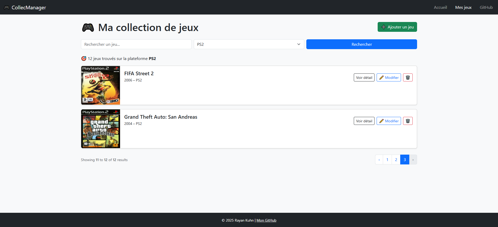
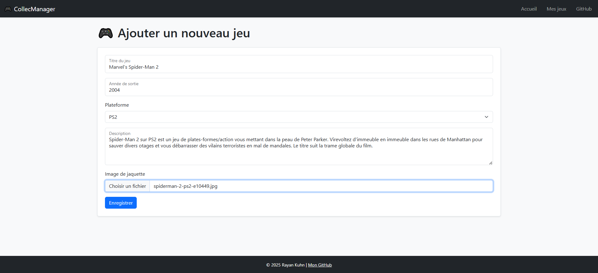
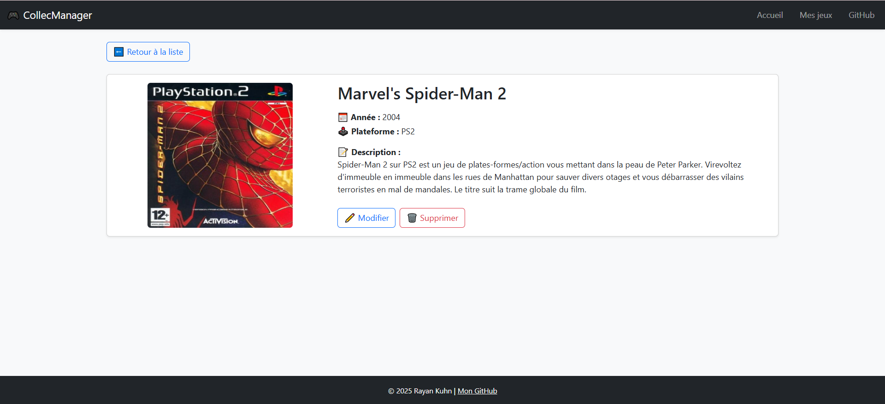

# 🎮 Laravel Collection Jeux

> 🇫🇷 Une application simple mais évolutive pour gérer ta collection de jeux vidéo.  
> 🇬🇧 A simple yet scalable app to manage your video game collection.

---

## 🇫🇷 Présentation

Laravel Collection Jeux est une mini-application construite avec **Laravel 11** et **Bootstrap 5**, qui permet d'ajouter, modifier, supprimer et rechercher des jeux vidéo dans une collection personnelle.

🔧 Le projet est pensé comme un support d’apprentissage pour découvrir Laravel avec des fonctionnalités concrètes :

- ✅ CRUD complet
- ✅ Filtrage et recherche (titre + plateforme)
- ✅ Pagination intelligente
- ✅ Upload et redimensionnement d'image
- ✅ Affichage responsive
- ✅ Enum PHP pour les plateformes

---

## 🇬🇧 Description

Laravel Collection Jeux is a mini-app built with **Laravel 11** and **Bootstrap 5** to manage your personal video game collection.

🎯 The project was designed as a learning tool to master Laravel through hands-on features:

- ✅ Full CRUD
- ✅ Filtering and search (title + platform)
- ✅ Smart pagination
- ✅ Image upload and resizing
- ✅ Responsive layout
- ✅ Native PHP Enums for platforms

---

## 📸 Screenshots

### 🏠 Page d’accueil
<p align="center">
  
</p>

### 📁 Liste des jeux avec filtres
<p align="center">
  
</p>

### ➕ Ajouter un jeu
<p align="center">
  
</p>

### 🔍 Fiche de détail
<p align="center">
  
</p>


---

## 🚀 Pour lancer l'application

```bash
git clone https://github.com/RayanKuhn/laravel-collection-jeux.git
cd laravel-collection-jeux
composer install
cp .env.example .env
php artisan key:generate
php artisan migrate
php artisan storage:link
php artisan serve
```

### 📚 Technologies utilisées
Laravel 11

PHP 8.3+

Bootstrap 5

Intervention/Image

Enum PHP natif

### ✍️ Auteur
Rayan Kuhn – Développeur en formation, passionné, en reconversion
